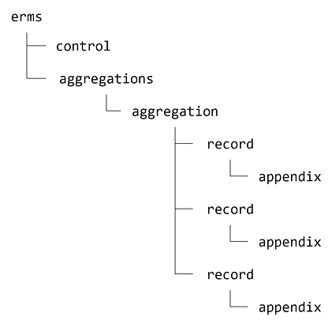
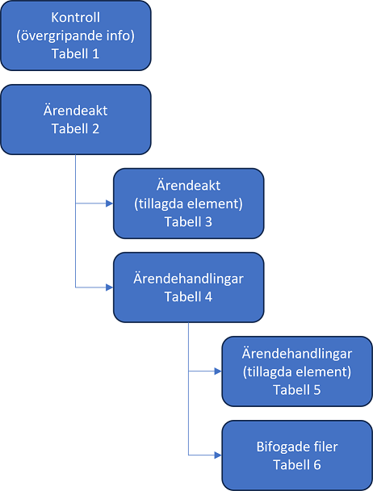
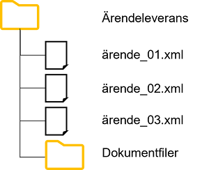

*README-filen innehåller ett utdrag ur Svenska kyrkans gemensamma specifikationer för elektronisk arkivering - Ärendehandlingar*.
Se hela specifikationen här: SvKGS Ärendehandlingar

# SvKGS-Ärendehandlingar

***Version 1.0***

# 1. Inledning

Svenska kyrkans gemensamma specifikationer för elektronisk arkivering beskriver vilken in¬formation som ska
ingå vid leverans till Svenska kyrkans gemensamma e-arkiv och hur denna information ska struktureras.

Leveranser till e-arkivet delas in i informationstyper. Exempel på sådana kan vara ärendeakter med handlingar,
ekonomisk redovisning, löneredovisning, personalakter, information om gravrätter, projekthandlingar, bilder
och så vidare. Varje informationstyp kan behöva sin egen specifikation.

Beteckningen gemensamma specifikationer anger att specifikationerna gäller alla leveranser till e-arkivet oavsett
vem det är som levererar informationen och oavsett vilket IT-system som leveranser kommer ifrån.
Genom att informationen arkiveras på detta standardiserade sätt underlättas det långsiktiga bevarande
och möjligheten att återsöka den arkiverade informationen. Standardformatet kan utöver e-arkivering
även användas vid migrering av information mellan andra IT-system.

Svenska kyrkans gemensamma specifikationer är i första hand anpassningar av de specifikationer som
förvaltas av *the Digital Information LifeCycle Interoperability Standards Board* (DILCIS Board).
De kan också vara anpassningar av de förvaltningsgemensamma specifikationer (FGS) som har upprättats av Riksarkivet.
Specifikationerna kan också utgå ifrån andra standarder, om det finns några som är särskilt lämpliga
för informationstypen i fråga.

- [Dilcis Board](https://dilcis.eu)
- [Riksarkivet FGS](https://riksarkivet.se/fgs-earkiv)

## 1.1. Arkivpaket

Leverans av information till e-arkivet sker i form av arkivpaket. Ett paket är en mappstruktur med filer.
Paketet innehåller den levererade informationen, arkivobjektet, men också metadata som beskriver
informationen och den levererande arkivbildaren.

Specifikationerna i det här dokumentet beskriver arkivobjektet, det vill säga den information som
ska arkiveras. Det utgör endast en del av hela arkivpaketet.

Arkivpaketet i sin helhet utformas i enlighet med Riksarkivets specifikation
[FGS Paketstruktur 1.2](https://riksarkivet.se/Media/pdf-filer/doi-t/FGS_Paketstruktur_RAFGS1V1_2.pdf).

# Specifikationer för ärendehandlingar

*SvKGS Ärendehandlingar* avser arkivering av ärendeakter med tillhörande handlingar.
Specifikationerna är främst avsedda för arkivering av information från diarieföringssystem som
t.ex. Tietoevrys **Public 360°**, Vitecs **Acta** och **FAS** samt Eniacs **Aveny**.

Registrerad information om ett ärende och dess ingående handlingar bevaras i ett XML-dokument som
regleras av specifikationerna genom användandet av scheman (XSD och Schematron).
Även bifogade filer (i godkänt arkivformat) kan arkiveras.

*SvKGS Ärendehandlingar* följer helt och hållet *Specification for the E-ARK Content Information Type
Specification for Electronic Records Management Systems* (ERMS) version 2.1.0.
Detta innebär att specifikationen också följer [FGS Ärendehantering 2.0](https://www.riksarkivet.se/faststallda-kommande-fgser)
och [Riksarkivets tillämpning av CITS ERMS (för överlämnande till Riksarkivet)](https://www.riksarkivet.se/Media/pdf-filer/doi-t/Riksarkivets_tillampning_CITS_ERMS_overlamnande_V1.0.pdf). 

ERMS tillåter att man gör anpassningar för den egna organisationens behov.
För användning i Svenska kyrkan har ett antal anpassningar gjorts.
Dessa redovisas nedan i detta dokument.

## 2.2. XML-dokumentet

Det XML-dokument som innehåller information om en ärendeakt och de ingående handlingarna definieras i ett XML-schema.
Se avsnittet Scheman nedan. Detta är XML-dokumentets grundläggande uppbyggnad:



*Figur 1. Grundläggande struktur i ett XML-dokument.*

Elementet `erms` är dokumentets rot-element. Elementet `control` innehåller underelement med information om
själva XML-dokumentet (se Tabell 1).

Elementet `aggregations` rymmer underelement av typen aggregation, vilket i det här fallet betyder ärendeakt
(se Tabell 2 och Tabell 3). Notera att det i *SvKGS Ärendehandlingar* endast får finnas en aggregation i varje XML-dokument.

Elementet `aggregation` kan innehålla flera element av typen record, alltså ärendehandlingar (se Tabell 4 och Tabell 5).
Varje `record` kan innehålla elementet `appendix` som är en bifogad fil till den registrerade handlingen (se Tabell 6).

Observera att det tillagda elementet `svkAppendix` används i *SvKGS Ärendehandlingar* i stället för ERMS-elementet `appendix`.

I tabellerna nedan finns de element som bör eller måste finnas i ett XML-dokument enligt *SvKGS Ärendehandlingar*.
Tabellerna följer strukturen i XML-dokumentet:



*Figur 2. Översikt av tabeller med dataelement.*

## 2.3. Värdelistor

I många fall är det värde som får anges i ett dataelement begränsat till värden som finns i en specificerad värdelista.
De värdelistor som ingår i *SvKGS Ärendehandlingar* finns nedan i detta dokument.
Värdelistorna kan innehålla värden från ERMS eller vara tillagda värden och är därför också en del av
Svenska kyrkans anpassning av ERMS. Utgångspunkten har varit att så långt som möjligt använda värden från ERMS.

## 2.4. Scheman

XML-scheman och Schematron används i ERMS för att på ett mer tekniskt sätt definiera hur dataelementen
ska utformas. Scheman kan också användas för att validera ett XML-dokument så att man kan avgöra om det
följer specifikationen.

I ERMS ingår schemana [ERMS.xsd](https://citserms.dilcis.eu/schema/ERMS.xsd) och [ERMS.sch](https://citserms.dilcis.eu/schema/erms.sch).

I *SvKGS Ärendehandlingar* används schemana

**ERMS.xsd**<br/>
Schemat används för att validera de delat av XML-dokumentet som följer ERMS-standard.

**ERMS-SVK-element.xsd**<br/>
I detta schema definieras alla element som är Svenska kyrkans tillägg till ERMS. Schemat är alltså inte
specifikt för *SvKGS Ärendehandlingar* utan används i andra anpassningar av ERMS.
Schemat är publikt tillgängligt på [Github](https://github.com/svkau/SvKGS-Arendehandlingar).

**ERMS-SVK-ARENDE.xsd**<br/>
Schemat reglerar själva strukturen på den del av XML-dokumentet som utgörs av Svenska kyrkans tillägg
och vilka tillagda element som får användas i enlighet med SvKGS Ärendehandlingar.
Denna del av XML-dokumentet ingår i ERMS-elementet `additionalXMLData`.

**ERMS-SVK-ARENDEN.sch**<br/>
Schemat innehåller dels de regler som ingår i ERMS-standarden (ERMS.sch), dels Svenska kyrkans regler som
de beskrivs i *SvKGS Ärendehandlingar*. De två sistnämnda schemana är specifika för
*SvKGS Ärendehandlingar* och är publikt tillgängliga på [Github](https://github.com/svkau/SvKGS-Arendehandlingar).

En särskild anmärkning om elementet `appendix` i behöver göras. Eftersom det har funnits behov av att
utöka detta element med flera underelement, och då det inte finns något element `additionalXMLData` här,
används inte `appendix` utan i stället ett eget element `svkAppendix` som definieras i ERMS-SVK-element.xsd.

Användandet av elementet appendix förbjuds genom en regel i ERMS-SVK.sch.

För att validera ett XML-dokument och avgöra om det följer specifikationerna i *SvKGS Ärendehandlingar*, måste man
alltså använda både **ERMS.xsd** och **ERMS-SVK-ARENDE.xsd** (som i sin tur importerar och använder **ERMS-SVK-element.xsd**).
Därtill måste dokumentet valideras mot **ERMS-SVK-ARENDE.sch**.

## 2.5. Datatyper

Värden som anges i dataelementen måste vara av de datatyper som definieras i XML-schemana.
Datatyper som kan förekomma är:

- [string](https://www.w3.org/TR/xmlschema-2/#string)
- [token](https://www.w3.org/TR/xmlschema-2/#token)
- [integer](https://www.w3.org/TR/xmlschema-2/#integer)
- [decimal](https://www.w3.org/TR/xmlschema-2/#decimal)
- [dateTime](https://www.w3.org/TR/xmlschema-2/#dateTime)
- [boolean](https://www.w3.org/TR/xmlschema-2/#boolean)

För att ange datum används alltid datatypen dateTime, vilket betyder att både datum och klocklag ned till
sekundnivå ska anges i [UTC-format](https://sv.wikipedia.org/wiki/Koordinerad_universell_tid)
enligt [ISO 8601](https://sv.wikipedia.org/wiki/ISO_8601) (med bindestreck och kolon). Om klockslag saknas används
noll-tecken. Tidszon anges i regel inte och förutsätts då vara Europe/Stockholm.

Exempel på datum och tid: `2018-03-04T15:15:22`. Enbart datum: `2020-09-17T00:00:00`.

Vid angivande av tal (integer och decimal) används inte tusentalsavgränsare.

Vid angivande av decimal används punkt som decimalavgränsare.

## 2.6. Råd om användandet av *SvKGS Ärendehandlingar*

I tabellerna med dataelement nedan har varje element en identifieringskod (t.ex. ERMS-SVK:1).
Även elementets motsvarande kod i ERMS anges, om det inte är ett tillagt element.

Om ett element är obligatoriskt, anges detta särskilt. I annat fall är det frivilligt att använda elementet.

Element kan få förekomma en enda gång eller upprepade gånger i ett XML-dokument.
Om ett element får upprepas, anges detta särskilt. I annat fall får elementet endast förekomma en gång.

I tabellerna anges också motsvarande XML-elements namn och vilken datatyp som ska användas.

Informationen i det levererande IT-systemet måste mappas mot specifikationens dataelement och sedan transformeras
till ett XML-format som kan valideras av de scheman som ingår i specifikationen.
Alla XML-filer måste ha teckenkodning UTF-8.

En XML-fil får enbart innehålla ett enda ärende, men leveransen kan bestå av flera filer.
Filerna samlas i en mapp, och om leveransen innehåller dokumentfiler samlas dessa i en undermapp.
Varje sådant leveranspaket får bara innehålla ärenden från en och samma arkivbildare och ett och samma diarium.



*Figur 3. Mappstruktur för ärendeleverans. Namn på mappar och filer är enbart exempel.*

Innan en leverans till e-arkivet görs, måste den levererande parten och e-arkivets förvaltningsorganisation
tillsammans upprätta en leveransöverenskommelse där villkor och förutsättningar för leveransen specificeras.
Se mer om leveransförfarandet i Arkivhandboken, kapitel 8.

# 3. Dataelement med exempel

## 3.1. Övergripande information om XML-dokumentet

Kontroll är ett obligatoriskt element som beskriver själva XML-filen och vad den innehåller.
Den underlättare förståelsen av informationen, om XML-filen skulle separeras från arkivpaketet.

### Tabell 1. Kontroll

---

**ERMS-SVK:1** (ERMS1)

*Identifikator*

> Identifierar ERMS-dokumentet

> Obligatoriskt. Elementet får upprepas.

> Tre identifikatorer måste användas: arkivbildarens namn och id samt ärendets nummer. Se exempel nedan.

> **XML-element:**	`identification`<br/>
> **Datatyp:**	string

---

**ERMS-SVK:2** (ERMS2)

*Typ av identifikator*

> Beskrivning av identifikatorn.

> Obligatoriskt. Värdet väljs från SVK-värdelista 1.

> **XML-element:**	`identification/@identificationType`<br/>
> **Datatyp:**	string

---

**xempel 1 – Identifikator**

```xml
<control>
    <identification identificationType="arkivbildare">Sunne pastorat</identification>
	<identification identificationType="organisationsnummer">1234567890</identification>
	<identification identificationType="aid">5610</identification>
	<identification identificationType="ärendenummer">P 2019-0254</identification>
</control>
```

---

**ERMS-SVK:3** (ERMS3)

*Informationsklassning*

> Informationsklass som baseras på säkerhetsklassificering.

> **XML-element:**	`informationClass`<br/>
> **Datatyp:**	string

---

**ERMS-SVK:4** (ERMS4-6)

*Klassificeringsstruktur*

> Den klassificeringsstruktur som har använts vid klassificering av det aktuella ärendet.

> Obligatoriskt. Värdet välj från SVK-värdelista 2.

> **XML-element:**	`classificationSchema/textualDescriptionOfClassificationSchema/p` <br/>
> **Datatyp:**	string

---

**Exempel 2 – Klassificeringsstruktur**

```xml
<control>
	<classificationSchema>
		<textualDescriptionOfClassificationSchema>
			<p>KlaSL2016_1.0</p>
		</textualDescriptionOfClassificationSchema>
	</classificationSchema>
</control>
```
**ERMS-SVK:5** (ERMS8)

*Säkerhetsklassning*

> Säkerhetsklass.

> **XML-element:**	`securityClass` <br/>
> **Datatyp:**	string

---

**ERMS-SVK:6** (ERMS10)

*Underhåll*

> Samlingselement för underhållsinformation som används för att beskriva XML-dokumentets tillkomst och eventuella ändringar.

> Obligatoriskt.

> **XML-element:**	`maintenanceInformation`

---

**ERMS-SVK:7** (ERMS11)

*Status*

> XML-dokumentets status.

> Obligatoriskt. Värdet välj från SVK-värdelista 3.
>
> För ett nyskapat dokument är värdet alltid `new`.

> **XML-element:**	`maintenanceStatus/@value` <br/>
> **Datatyp:**	string

---

**ERMS-SVK:8** (ERMS12)

*Skapare*

> Samlingselement med beskrivning av den instans som har skapat XML-dokumentet.

> Obligatoriskt.

> **XML-element:**	`maintenanceAgency`

---

**ERMS-SVK:9** (ERMS13)

*Skapare ID*

> Identifierande kod för den instans som har skapat XML-dokumentet.

> Obligatoriskt.

> **XML-element:**	`agencyCode`<br/>
> **Datatyp:**	string

---

**ERMS-SVK:10** (ERMS14)

*Typ av ID*

> Beskriver vilken typ av kod som har använts för att identifiera skaparen av XML-dokumentet.

> Obligatoriskt. Värdet väljs från SVK-värdelista 4.

> **XML-element:**	`agencyCode/@type`<br/>
> **Datatyp:**	string

---

**ERMS-SVK:11** (ERMS15)

*Alternativt ID*

> Ytterligare en identifierande kod som kan användas vid behov.

> **XML-element:**	`otherAgencyCode<br/>
> **Datatyp:**	string

---

**ERMS-SVK:12** (ERMS16)

*Typ av alternativt IDID*

> Samma som ovan (ERMS-SVK:10)

> Obligatoriskt om Alternativt ID används.

> **XML-element:**	`otherAgencyCode/@type`<br/>
> **Datatyp:**	string

---

**ERMS-SVK:13** (ERMS17)

*Skapare Namn*

> Namn på den instans som har skapat XML-dokumentet.

> Obligatoriskt.

> **XML-element:**	`agencyName`<br/>
> **Datatyp:**	string

---

**ERMS-SVK:14** (ERMS19)

*Underhållshistoria*

>Samlingselement för dokumentets underhållshistoria.

> Obligatoriskt.

> **XML-element:**	`maintenanceHistory`

---

**ERMS-SVK:15** (ERMS20)

*Underhållshändelse*

> En händelse i dokumentets underhållshistoria.

> Obligatoriskt. Elementet kan upprepas.
> 
> När XML-dokumentet skapas, får det en *Underhållshändelse* av typen `created`.

> **XML-element:**	`maintenanceEvent`

---

**ERMS-SVK:16** (ERMS21)

*Typ av händelse*

> Typ av underhållshändelse.

> Obligatoriskt. Värdet väljs från SVK-VÄRDELISTA 5.

> **XML-element:**	`eventType/@value`<br/>
> **Datatyp:**	token

---

**ERMS-SVK:17** (ERMS22)

*Datum för händelse*

> Datum då underhållshändelsen inträffade.

> Obligatoriskt.

> **XML-element:**	`eventDateTime`<br/>
> **Datatyp:**	dateTime

---

**ERMS-SVK:18** (ERMS23)

*Utförare*

> Den agent som har utfört handlingen.

> Obligatoriskt.

> **XML-element:**	`agent`

---

**ERMS-SVK:19** (ERMS93)

*Typ av utförare*

> Anger vilken egenskap utföraren har i förhållande till den utförda handlingen.

> Obligatoriskt. Värdet väljs från SVK-VÄRDELISTA 6.

> **XML-element:**	`agent/@agentType`<br/>
> **Datatyp:**	string

---

**ERMS-SVK:20** (ERMS95)

*Namn*

> Namn på den person eller organisation som har utfört handlingen.

> Obligatoriskt.

> **XML-element:**	`agent/name`<br/>
> **Datatyp:**	string

---

**ERMS-SVK:21** (ERMS99)

*Organisation*

> Organisationstillhörighet.

> Obligatoriskt om det är en person som är agent.

> **XML-element:**	`agent/organisation`<br/>
> **Datatyp:**	string

---

**Exempel 3 – Underhåll**

```xml
<control>
	<maintenanceInformation>
		<maintenanceStatus value="new"/>
		<maintenanceAgency>
			<agencyCode type="organisationsnummer">1234567876</agencyCode>
				<agencyName>Kyrkostyrelsen</agencyName>
		</maintenanceAgency>
		<maintenanceHistory>
			<maintenanceEvent>
				<eventType value="created"/>
				<eventDateTime>2001-12-17T09:30:47</eventDateTime>
				<agent agentType="deliverer">
					<name>Public 360</name>
					<organisation>Tietoevry</organisation>
				</agent>
			</maintenanceEvent>
		</maintenanceHistory>
	</maintenanceInformation>
</control>
```

---

## 3.2. Information om ärendeakter

### Tabell 2. Ärendeakter

---

**ERMS-SVK:22** (ERMS198)

*Ärendeakt*

> Samlingsobjekt för ärendeakten med ingående dokument och filer.

> Obligatoriskt.
> 
> Varje ärendeakt ska dokumenteras i en XML-fil, och ingen XML-fil får innehålla mer än en ärendeakt.

> **XML-element:**	`aggregation`

---

**ERMS-SVK:23** (ERMS199)

*Identifikator*

> Identifikator för ärendeakten i form av UUID. Identifikatorn anges automatiskt redan i det levererande systemet eller vid överföring till e-arkivet.

> Obligatoriskt.

> **XML-element:**	`aggregation/@systemIdentifier`<br/>
> **Datatyp:**	string

---

**ERMS-SVK:24** (ERMS200)

*Typ av aggregation*

> Typ av aggregation, vilket i den här specifikationen alltid är ”caseFile”, det vill säga ”ärendeakt”.

> Obligatoriskt.

> **XML-element:**	`aggregation/@aggregationType=”caseFile”`<br/>
> **Datatyp:**	string

---

**Exempel 4 – Ärendeakt**

```xml
<aggregation systemIdentifier="3b9fbc5f-3eaf-4521-9726-0f142feb04c3" aggregationType="caseFile">
```

---

**ERMS-SVK:25** (ERMS218)

*Ärendenummer*

> Ärendets officiella nummer, ”diarienumret”.

> Obligatoriskt.
> 
> Ärendenumret ska ha formatet [diariekod] [årtal]-[löpnummer].
> Diariekoden ska bestå av versaler. Löpnumret ska bestå av fyra siffror
> och fylls vid behov ut med nollor, t.ex. S 2019-0043.

> **XML-element:**	`objectId`<br/>
> **Datatyp:**	string

---

**ERMS-SVK:26** (ERMS219)

*Arkivansvarigs ID*

> Ett unikt ID för den arkivansvariga enheten.

> Obligatoriskt. Värdet på attributet `extraIdType` hämtas från SVK-värdelista 4.

> **XML-element:**	`extraId`<br/>
> **Datatyp:**	string

---

**ERMS-SVK:27** (ERMS219)

*Intern identifikator*

> Befintligt id i det levererande systemet.

> Om elementet *Intern identifikator* används, måste attributet `extraIdType` ha värdet ”deliveringSystemId”.

> **XML-element:**	`objectId`<br/>
> **Datatyp:**	string

---

**Exempel 5 – Ärendenummer och Intern identifikator**

```xml
<aggregation>
	<objectId>F 2019-0032</objectId>
	<extraId extraIdType="organisationsnummer">0987654321</extraId>
	<extraId extraIdType="deliveringSystemId">34565</extraId>
</aggregation>
```

---

**ERMS-SVK:28** (ERMS202)

*Informationsklassning*

> Ärendets informationsklass.

> **XML-element:**	`informationClass`<br/>
> **Datatyp:**	string

---

**ERMS-SVK:29** (ERMS203)

*Säkerhetsklassning*

> Ärendets säkerhetsklass.

> **XML-element:**	`securityClass`<br/>
> **Datatyp:**	string

---

**ERMS-SVK:30** (ERMS208)

*Klassificering*

> Namnet på den process i den officiella klassificeringsstrukturen som har angivits som klassificering av ärendet och de ingående handlingarna.

> **XML-element:**	`classification`<br/>
> **Datatyp:**	string

---

**ERMS-SVK:31** (ERMS75)

*Klassificeringskod*

> Namnet på den process i den officiella klassificeringsstrukturen som har angivits som klassificering av ärendet och de ingående handlingarna.

> **XML-element:**	`classification/@classificationCode`<br/>
> **Datatyp:**	string

---

**Exempel 6 – Klassificering**

```xml
<aggregation>
	<classification classificationCode="2.7">Ge service</classification>
</aggregation>
```

---

**ERMS-SVK:32** (ERMS223)

*Nyckelord*

> Samlingselement för enskilda nyckelord.

> **XML-element:**	`keywords`<br/>

---

**ERMS-SVK:33** (ERMS224)

*Nyckelord*

> Enskilt nyckelord.

> Elementet kan upprepas.

> **XML-element:**	`keyword`<br/>
> **Datatyp:**	string

---

**Exempel 7 – Nyckelord**

```xml
<aggregation>
	<keywords>
		<keyword>församlingsordning</keyword>
		<keyword>kyrkorådet</keyword>
	</keywords>
</aggregation>
```

---

**ERMS-SVK:34** (ERMS209)

*Ärendemening*

> Ärendemening, ärendets titel.

> **XML-element:**	`title`<br/>
> **Datatyp:**	string

---

**ERMS-SVK:35** (ERMS210)

*Offentlig titel*

> Används endast för Offentlig titel i leveranser från Public 360°.

> Om elementet `otherTitel` används måste attributet `titleType` ha värdet ”publicTitle”.

> **XML-element:**	`otherTitle`<br/>
> **Datatyp:**	string

---

**Exempel 8 – Ärendemening och Annan titel**

```xml
<aggregation>
	<title>Ärendets titel</title>
	<otherTitle titleType="publicTitle">En offentlig titel</otherTitle>
</aggregation>
```

---

**ERMS-SVK:36** (ERMS239)

*Ärendestatus*

> Ärendets status.

> Obligatoriskt. Värdet väljs från värdelistan SVK-värdelista 7.
>
> Giltiga värden:”closed” (avslutat) eller ”obliterated” (makulerat).
 
```xml
<aggregation>
	<status value="closed"/>
</aggregation>
```

> **XML-element:**	`status/@value`<br/>
> **Datatyp:**	string

---

**ERMS-SVK:37** (ERMS52-53)

*Ärendereferens*

> Referens till och/eller från annat ärende.

> Elementet kan upprepas.
>
> Om möjligt anges det andra ärendets *Ärendenummer* enligt specifikationen i detta dokument,
> annars ärendenumret i annat format eller fritext.
> 
> Om elementet *Ärendereferens* används, måste attributet `relationType` ha värdet ”reference”.

> **XML-element:**	`relation`<br/>
> **Datatyp:**	string

---

**Exempel 9 – Ärendereferens**

```xml
<aggregation>
	<relation relationType="reference">F 2019-0454</relation>
</aggregation>
```

---

**ERMS-SVK:38** (ERMS252, ERMS43)

*Utökad XML-data*

> Utökad XML-data är en del av Svenska kyrkans anpassning av ERMS.

> Obligatoriskt
> 
> Se Tabell 3.

> **XML-element:**	`additionalXMLData`<br/>

---

**ERMS-SVK:39** (ERMS253, ERMS57)

*Sekretess*

>Samlingselement för uppgift om sekretess.

> Elementet kan upprepas.
>
> Om elementet *Sekretess* används måste attributet `restrictionType` ha värdet ”confidential”.

> **XML-element:**	`restriction`<br/>

---

**ERMS-SVK:40** (ERMS253, ERMS57)

*Förklarande text*

>Fritext som beskriver sekretessen.

> **XML-element:**	`explanatoryText`<br/>
> **Datatyp:**	string

---

**ERMS-SVK:41** (ERMS59)

*Lagrum*

>Hänvisning till paragraf i kyrkoordningens 54 kapitel, till Offentlighets- och sekretesslagen
> eller till annat lagrum som stöder den angivna sekretessen.

> **XML-element:**	`regulation`<br/>
> **Datatyp:**	string

---

**ERMS-SVK:42** (ERMS62)

*Sekretessdatum*

>Datum från och med vilket sekretessen anses gälla.

>Om elementet *Sekretessdatum* används, måste attributet `dateType` ha värdet ”created”.

> **XML-element:**	`dates/date`<br/>
> **Datatyp:**	dateTime

---

**Exempel 10 – Sekretess**

```xml
<aggregation>
	<restriction restrictionType="confidential">
		<explanatoryText>Sekretess enligt KO</explanatoryText>
		<regulation>KO 54:2</regulation>
		<dates>
			<date dateType="created">2020-01-02T00:00:00</date>
		</dates>
	</restriction>
</aggregation>
```

---

**ERMS-SVK:43** (ERMS230-235)

*Aktörer*

>Samlingselement för alla agerande parter i ärendet.

> **XML-element:**	`agents`<br/>

---

**ERMS-SVK:44** (ERMS230)

*Skapare*

>Den som har skapat ärendet i systemet.

>Om elementet *Skapare* används, måste attributet `agentType` ha värdet ”creator”.
> 
> Namn och användarnamn anges i underelementen `name` (obligatoriskt) och `idNumber` (frivilligt). Se exemplet nedan.
> 
> Om `idNumber` används hämtas värdet från SVK-värdelista 8.

> **XML-element:**	`agent`, `name` (string), `idNumber`<br/>

---

**ERMS-SVK:45**

*Handläggare*

>Ansvarig handläggare för ärendet.

>Om elementet *Handläggare* används, måste attributet `agentType` ha värdet ”responsible_person”.
> 
> Namn och användarnamn anges i underelementen `name` (obligatoriskt) och `idNumber` (frivilligt). Se exemplet nedan.
> 
> Om `idNumber` används hämtas värdet från SVK-värdelista 8.

> **XML-element:**	`agent`, `name` (string), `idNumber`<br/>

---

**ERMS-SVK:46** (ERMS232)

*Medhandläggare*

>Eventuella medhandläggare utöver den ansvariga.

> Elementet kan upprepas.
> 
>Om elementet *Medhandläggare* används, måste attributet `agentType` ha värdet ”editor”.
> 
> Namn och användarnamn anges i underelementen `name` (obligatoriskt) och `idNumber` (frivilligt). Se exemplet nedan.
> 
> Om `idNumber` används hämtas värdet från SVK-värdelista 8.

> **XML-element:**	`agent`, `name` (string), `idNumber`<br/>

---

**ERMS-SVK:47**

*Ärendepart*

>Extern part i ärendet.

> Elementet kan upprepas.
> 
>Om elementet *Ärendepart* används, måste attributet `agentType` ha värdet ”counterpart”.
> 
> Namn och användarnamn anges i underelementen `name` (obligatoriskt) och `idNumber` (frivilligt). Se exemplet nedan.
> 
> Om `idNumber` används hämtas värdet från SVK-värdelista 8.

> **XML-element:**	`agent`, `name` (string), `idNumber`<br/>

---

**ERMS-SVK:48**

*Annan aktör*

>Annan typ av aktör eller kontakt kopplad till ärendet.

> Elementet kan upprepas.
> 
>Om elementet *Annan aktör* används, måste attributet `agentType` ha värdet ”agent”.
> 
> Namn och användarnamn anges i underelementen `name` (obligatoriskt) och `idNumber` (frivilligt). Se exemplet nedan.
> 
> Om `idNumber` används hämtas värdet från SVK-värdelista 8.

> **XML-element:**	`agent`, `name` (string), `idNumber`<br/>

---

**ERMS-SVK:49**

*Avslutare*

>Den som har avslutat eller makulerat ärendet.

>Om elementet *Avslutare* används, måste attributet `agentType` ha värdet ”other”
> och `otherAgentType` värdet ”closing_person”.
> 
> Namn och användarnamn anges i underelementen `name` (obligatoriskt) och `idNumber` (frivilligt). Se exemplet nedan.
> 
> Om `idNumber` används hämtas värdet från SVK-värdelista 8.

> **XML-element:**	`agent`, `name` (string), `idNumber`<br/>

---

**Exempel 11 – Aktörer**

```xml
<aggregation>
	<agents>
		<agent agentType="creator">
			<name>Anna Andersson</name>
			<idNumber idNumberType="username">svkanan</idNumber>
		</agent>
		<agent agentType="responsible_person">
			<name>Johan Göransson</name>
			<idNumber idNumberType="username">svkjogo</idNumber>
		</agent>
		<agent agentType="counterpart">
			<name>Försäkringskassan</name>
		</agent>
		<agent agentType="other" otherAgentType="closing_person">
			<name>Erik Gustavsson</name>
			<idNumber idNumberType="username">svkergu</idNumber>
		</agent>
	</agents>
</aggregation>
```

---

**ERMS-SVK:50** (ERMS211)

*Beskrivning*

>En beskrivning av ärendet utöver *Ärendemening*.

> **XML-element:**	`description`<br/>
> **Datatyp:**	string

---

**ERMS-SVK:51** (ERMS204-206)

*Datum*

>Samlingselement för datum som gäller för ärendet.

> **XML-element:**	`dates`<br/>

---

**ERMS-SVK:52** (ERMS232)

*Skapat*

>Datum då ärendet skapades i systemet. Här avses ett av systemet automatiskt satt datum.

>Obligatoriskt.
> 
> Om uppgiften saknas i diariesystemet, används samma datum som för *Öppnat*.
> 
> Om elementet *Skapat* används, måste `dateType` ha värdet ”created”.

> **XML-element:**	`date/@dateType=”created”`<br/>
> **Datatyp:**	dateTime

---

**ERMS-SVK:53**

*Öppnat*

>Datum då ärendet officiellt öppnades.

>Obligatoriskt.
> 
> Om elementet *Öppnat* används, måste `dateType` ha värdet ”opened”.

> **XML-element:**	`date/@dateType=”opened”`<br/>
> **Datatyp:**	dateTime

---

**ERMS-SVK:54**

*Avslutat*

>Datum då ärendet avslutades eller makulerades.

>Obligatoriskt.
> 
> Om elementet *Avslutat* används, måste `dateType` ha värdet ”closed”.

> **XML-element:**	`date/@dateType=”closed”`<br/>
> **Datatyp:**	dateTime

---

**Exempel 12 – Datum**

```xml
<aggregation>
	<dates>
		<date dateType="created">2020-05-20T00:00:00</date>
		<date dateType="opened">2020-05-22T00:00:00</date>
		<date dateType="closed">2020-05-30T00:00:00</date>
	</dates>
</aggregation>
```

---

**ERMS-SVK:55** (ERMS240)

*Beslut i ärendet*

>Samlingselement som används för uppgifter om beslut som har fattats i ärendet och
> som i diariesystemet har registrerats separat och inte som en vanlig handling.

>Elementet kan upprepas.

> **XML-element:**	`action`<br/>

---

**ERMS-SVK:56** (ERMS84)

*Beslutstext*

>Beslutets lydelse samt ev. referens till protokoll.

> Obligatoriskt om elementet *Beslut i ärendet* används.

> **XML-element:**	`actionText`<br/>
> **Datatyp:**	string

---

**ERMS-SVK:57** (ERMS87)

*Typ av händelse*

> Obligatoriskt om elementet *Beslut i ärendet* används.
> 
> Elementet måste ha värdet ”beslut”.

> **XML-element:**	`actionType`<br/>
> **Datatyp:**	string

---

**ERMS-SVK:58** (ERMS89, ERMS47)

*Beslutsdatum*

> Datum då beslutet fattades.
 
> Om elementet *Beslutsdatum* används, måste `dateType` ha värdet ”decision_date”.

> **XML-element:**	`dates/date/@dateType=”decision_date”`<br/>
> **Datatyp:**	dateTime

---

**ERMS-SVK:59** (ERMS90-91, 93)

*Beslutsfattare*

> Namn på person eller organ som har fattat beslutet.
 
> Underelementet `agent` används. Se exemplet nedan.
> 
> Om elementet *Beslutsfattare* används, måste `agentType` ha värdet ”authorising_person”.

> **XML-element:**	`agents/agent/name`<br/>
> **Datatyp:**	string

---

**Exempel 13 – Beslut i ärendet**

```xml
<aggregation>
	<action>
		<actionText>Beslutets lydelse</actionText>
		<actionType>beslut</actionType>
		<dates>
			<actionDate dateType="decision_date">2020-05-20T00:00:00</actionDate>
		</dates>
		<agents>
			<agent agentType="other" otherAgentType="authorising_person">
				<name>Kyrkorådet</name>
			</agent>
		</agents>
	</action>
</aggregation>
```

**ERMS-SVK:60** (ERMS212, ERMS50)

*Kommentar*

> Kommentar till ärendet.
 
> Kommentaren utgörs av en enda sammanhängande text och är inte möjlig att upprepa. Se exemplet nedan.
> 
> För upprepade kommentarer eller anteckningar används i stället elementet `svkNotes`, se Tabell 3.
>
> Om elementet *Kommentar* används, måste `noteType` ha värdet ”comment”.

> **XML-element:**	`notes/note`<br/>
> **Datatyp:**	string

---

**ERMS-SVK:61** (ERMS51)

*Datum för kommentar*

> Datum då kommentaren skapades.

> **XML-element:**	`notes/note/@noteDate`<br/>
> **Datatyp:**	dateTime

---

**Exempel 14 – Kommentar**

```xml
<aggregation>
	<notes>
		<note noteType="comment" noteDate="2019-02-21T00:00:00">Detta är en kommentar</note>
	</notes>
</aggregation>
```

---

**ERMS-SVK:62**

*Tilläggsinformation*

> De element som inte ingår i ERMS utan är tillägg i Svenska kyrkans anpassning är samlade i elementet *Tilläggsinformation*.

> Obligatoriskt.

> **XML-element:** `additionalInformation/additionalXMLData/svk:ermsSvkArende/svk:ermsSvkAggregation`<br/>

---

**ERMS-SVK:63**

*Schemaversioner*

> Anger vilka versioner av ERMS-SVK-ARENDE.xsd, ERMS.xsd, ERMS-SVK-element.xsd
> och ERMS-SVK-ARENDE.sch som XML-dokumentet är kompatibelt med.

> Obligatoriskt.

> **XML-element:**<br/>
> `svk:ermsSvkArende/`<br/>
> `@SchemaVersion="1.0"` (decimal)<br/>
> `@ermsSchemaVersion="2.1.2"` (token)<br/>
> `@elementSchemaVersion="1.0"` (decimal)<br/>
> `@schematronVersion="1.0">` (decimal)

---

**ERMS-SVK:64**

*Initiativ*

> Anger om initiativ till ärendets öppnande är externt
> (genom en inkommande handling), eller om ärendet har öppnats på eget (internt) initiativ.

> Värdet väljs från värdelistan SVK-värdelista 9.
> Möjliga värden: ”externt”eller ”eget”.

> **XML-element:** `svk:initiative`<br/>
> **Datatyp:** token

---

**ERMS-SVK:65**

*Relaterade objekt*

> Samlingselement med referenser till objekt som ärendet relaterar till.

> Objekten kan vara projekt eller fastigheter.

> **XML-element:** `svk:relatedObjects`<br/>

---

**ERMS-SVK:66**

*Relaterat objekt*

> Referens till objekt som ärendet relaterar till.

> Elementet kan upprepas.

> **XML-element:** `svk:relatedObject`<br/>

---

**ERMS-SVK:67**

*Typ av objekt*

> Anger vilken typ av objekt det är fråga om.

> Obligatoriskt om elementet *Relaterat objekt* används. Värdet väljs från SVK-värdelista 18.

> **XML-element:** `svk:relatedObject/@typeOfObject`<br/>
> **Datatyp:** token

---

**ERMS-SVK:68**

*Objektnamn*

> Det relaterade objektets namn.

> Obligatoriskt om elementet *Relaterat objekt* används.

> **XML-element:** `svk:objectName`<br/>
> **Datatyp:** token

---

**ERMS-SVK:69**

*ObjektID*

> Projektnummer, fastighetsbeteckning eller annan identifikator för objektet.

> Obligatoriskt om elementet *Relaterat objekt* används.

> **XML-element:** `svk:objectId`<br/>
> **Datatyp:** token

---

**ERMS-SVK:70**

*Internt ID*

> Objektets id-nummer i det levererande systemet.

> **XML-element:** `svk:deliveringSystemId`<br/>
> **Datatyp:** token

---

**Exempel 15 – Relaterat objekt**

```xml
<svk:ermsSvkAggregation>
	<svk:relatedObject>
		<svk:relatedObject typeOfObject="project">
			<svk:objectName>Omläggning av kyrktaket 2009</svk:objectName>
			<svk:objectId>P 2009:1</svk:objectId>
			<svk:deliveringSystemId>34958</svk:deliveringSystemId>
		</svk:relatedObject>
	</svk:relatedObjects >
</svk:ermsSvkAggregation>
```

---

**ERMS-SVK:71**

*Anteckningar*

> Samlingselement för anteckningar kopplade till ett ärende.

> **XML-element:** `svk:svkNotes`<br/>

---

**ERMS-SVK:72**

*Anteckning*

> Enskild anteckning kopplad till ärendet.

> Elementet kan upprepas.

> **XML-element:** `svk:svkNote`<br/>

---

**ERMS-SVK:73**

*Typ av anteckning*

> Kategorisering av anteckningen.

> Obligatoriskt om elementet *Anteckning* används. Värdet väljs från SVK-värdelista 10.

> **XML-element:** `svk:svkNote/@typeOfNote`<br/>
> **Datatyp:** token

---

**ERMS-SVK:74**

*Text*

> Anteckningens lydelse.

> Obligatoriskt om elementet *Anteckning* används.

> **XML-element:** `svk:noteText`<br/>
> **Datatyp:** string

---

**ERMS-SVK:75**

*Skapare av anteckning*

> Person som har gjort anteckningen.

> Obligatoriskt om elementet *Anteckning* används.

> **XML-element:** `svk:noteAuthor`<br/>
> **Datatyp:** token

---

**ERMS-SVK:76**

*Datum för anteckning*

> Datum och tid när anteckningen gjordes.

> Obligatoriskt om elementet *Anteckning* används.

> **XML-element:** `svk:noteDate`<br/>
> **Datatyp:** dateTime

---

**Exempel 17 – Anteckningar**

```xml
<svk:ermsSvkAggregation>
	<svk:svkNotes>
		<svk:svkNote typeOfNote="generell anteckning">
			<svk:noteText>Detta är en anteckning</svk:noteText>
			<svk:noteAuthor>Jörgen Persson</svk:noteAuthor>
			<svk:noteDate>2019-02-23T00:00:00</svk:noteDate>
		</svk:svkNote>
	</svk:svkNotes>
</svk:ermsSvkAggregation>
```

---

**ERMS-SVK:77**

*Ändringslogg*

> Samlingselement för loggningsuppgifter.

> **XML-element:** `svk:auditLogEvents`<br/>

---

**ERMS-SVK:78**

*Händelse*

> Enskild händelse i ändringsloggen.

> Obligatoriskt om elementet *Ändringslogg* används.

> **XML-element:** `svk:auditLogEvent`<br/>

---

**ERMS-SVK:79**

*Tid*

> Datum och tid då ändringen gjordes.

> Obligatoriskt om elementet *Händelse* används.

> **XML-element:** `svk:eventTime`<br/>
> **Datatyp:** dateTime

---

**ERMS-SVK:80**

*Användare*

> Namn på personen som gjorde ändringen.

> Obligatoriskt om elementet *Händelse* används.

> **XML-element:** `svk:user`<br/>
> **Datatyp:** token

---

**ERMS-SVK:81**

*Tillämpningsområde*

> Beskrivning av det som ändringen avser.

> Obligatoriskt om elementet *Händelse* används. Värdet väljs från SVK-värdelista 11.

> **XML-element:** `svk:scope`<br/>
> **Datatyp:** token

---

**ERMS-SVK:82**

*Åtgärd*

> Beskrivning av ändringen.

> Obligatoriskt om elementet *Händelse* används. Värdet väljs från SVK-värdelista 12.

> **XML-element:** `svk:action`<br/>
> **Datatyp:** token

---

**ERMS-SVK:83**

*Värde före ändring*

> Om ett värde har ändrats, anges här lydelsen före ändringen.

> **XML-element:** `svk:valueBeforeChange`<br/>
> **Datatyp:** token

---

**ERMS-SVK:84**

*Värde efter ändring*

> Om ett värde har ändrats, anges här lydelsen efter ändringen.

> **XML-element:** `svk:valueAfterChange`<br/>
> **Datatyp:** token

---

**Exempel 18 – Ändringslogg**

```xml
<svk:ermsSvkAggregation>
	<svk:auditLogEvents>
		<svk:auditLogEvent>
			<svk:time>2009-09-22T11:47:00</svk:time>
			<svk:user> Jörgen Persson</svk:user>
			<svk:scope>ärende</svk:scope>
			<svk:action>create</svk:action>
		</svk:auditLogEvent>
		<svk:auditLogEvent>
			<svk:time>2009-09-22T11:52:00</svk:time>
			<svk:user>Jörgen Persson</svk:user>
			<svk:scope>ärendemening</svk:scope>
			<svk:action>update</svk:action>
			<svk:valueBeforeChange>Upphandling av frysboxar</svk:valueBeforeChange>
			<svk:valueAfterChange>Upphandling av kylskåp</svk:valueAfterChange>
		</svk:auditLogEvent>
		<svk:auditLogEvent>
			<svk:time>2009-09-22T12:10:00</svk:time>
			<svk:user> Jörgen Persson </svk:user>
			<svk:scope>ärendestatus</svk:scope>
			<svk:action>update</svk:action>
			<svk:valueBeforeChange>Öppet</svk:valueBeforeChange>
			<svk:valueAfterChange>Makulerat</svk:valueAfterChange>
		</svk:auditLogEvent>
	</svk:auditLogEvents>
</svk:ermsSvkAggregation>
```

## 3.3. Information om ärendehandlingar

### Tabell 4. Ärendehandlingar

**ERMS-SVK:85** (ERMS129)

*Handling*

> Samlingselement med information om en i ärendet registrerad handling.

> Obligatoriskt. Elementet kan upprepas.

> **XML-element:** `record`<br/>

---

**ERMS-SVK:86** (ERMS130)

*Identifikator*

> Identifikator för dokumentet i form av UUID. Identifikatorn anges
> automatiskt redan i det levererande systemet eller vid överföring till e-arkivet.

> Obligatoriskt.

> **XML-element:** `record/@systemIdentifier`<br/>
> **Datatyp:** string

---

**ERMS-SVK:87** (ERMS131)

*Handlingstyp*

> Övergripande typ av handling. Motsvarar inte handlingstyp i arkivredovisning/dokumenthanteringsplan.

> Obligatoriskt. Värdet väljs från SVK-värdelista 13.
> 
> Oavsett handlingstyp kan värdet ”ärendedokument” alltid användas.

> **XML-element:** `record/@recordType`<br/>
> **Datatyp:** string

---

**ERMS-SVK:88** (ERMS132)

*Form*

> Anger om handlingen bara finns i fysisk form, bara i digital form eller både och.

> Värdet väljs från SVK-värdelista 14.

> **XML-element:** `recordPhysicalOrDigital`<br/>
> **Datatyp:** string

---

**Exempel 19 – Handling**

```xml
<record
	systemIdentifier="8dbbdc56-8ada-4ad5-a1ec-b8131a1086a2"
	recordPhysicalOrDigital="digital"
	recordType="ärendedokument">
```

**ERMS-SVK:89** (ERMS146)

*Handlingsnummer*

> En kombination av *Ärendenummer* (ERMS-SVK:25) och handlingens *Löpnummer*
> (ERMS-SVK:100) med kolon emellan.

> Obligatoriskt.
> 
> Exempel: `S 2010-0034:1`

> **XML-element:** `objectId`<br/>
> **Datatyp:** string

---

**ERMS-SVK:90** (ERMS148-149)

*Intern identifikator*

> Befintligt id i det levererande systemet.

> Om elementet *Intern identifikator* används, måste attributet `extraIdType` ha
> värdet ”deliveringSystemId”.

> **XML-element:** `objectId`<br/>
> **Datatyp:** string

---

**Exempel 20 – Handlingsnummer och Intern identifikator**

```xml
<record>
	<objectId>C 1995-0032:1</objectId>
	<extraId extraIdType="deliveringSystemId">34565</extraId>
```

**ERMS-SVK:91** (ERMS133)

*Informationsklassning*

> Handlingens informationsklass.

> **XML-element:** `informationClass`<br/>
> **Datatyp:** string

---

**ERMS-SVK:92** (ERMS134)

*Säkerhetsklassning*

> Handlingens säkerhetsklass.

> **XML-element:** `securityClass`<br/>
> **Datatyp:** string

---

**ERMS-SVK:93** (ERMS196)

*Klassificering*

> Namnet på den process i den officiella klassificeringsstrukturen som har
> angivits som klassificering av ärendet och de ingående handlingarna.

> **XML-element:** `classification`<br/>
> **Datatyp:** string

---

**ERMS-SVK:94** (ERMS75)

*Klassificeringskod*

> Koden för den process som angivits under *Klassificering*.

> **XML-element:** `classification/@classificationCode`<br/>
> **Datatyp:** string

---

**Exempel 21 – Klassificering**

```xml
<record>
	<classification classificationCode="2.7">Ge service</classification>
</record>
```

---

**ERMS-SVK:95** (ERMS152)

*Nyckelord*

> Samlingselement för enskilda nyckelord.

> **XML-element:** `keywords`<br/>

---

**ERMS-SVK:96** (ERMS153)

*Nyckelord*

> Enskilda nyckelord.

> Elementet kan upprepas.

> **XML-element:** `keyword`<br/>
> **Datatyp:** string

---

**Exempel 22 – Nyckelord**

```xml
<record>
    <keywords>
        <keyword>församlingsordning</keyword>
        <keyword>kyrkorådet</keyword>
    </keywords>
</record>
```
---

**ERMS-SVK:97** (ERMS)

*Titel*

> Titel eller en beskrivning av handlingen.

> Obligatoriskt.

> **XML-element:** `title`<br/>
> **Datatyp:** string

---

**ERMS-SVK:98** (ERMS)

*Offentlig titel*

> Används enbart för Offentlig titel i leveranser från Public 360°.

> Om elementet Annan titel används måste attributet titleType ha
> värdet ”publicTitle”.

> **XML-element:** `otherTitle`<br/>
> **Datatyp:** string

---

**Exempel 23 – Titel och Offentlig titel**

```xml
<record>
	<title>Handlingens titel</title>
	<otherTitle titleType="publicTitle">En offentlig titel</otherTitle>
</record>
```

---

**ERMS-SVK:99** (ERMS)

*Status*

> Handlingens status.

> Obligatoriskt. Värdet väljs från SVK-värdelista 7.
> 
> Värdet kan vara antingen ”closed”, vilket innebär att dokumentet är registrerat
> som inkommet eller upprättat, eller ”obliterated”, vilket betyder att det är
> makulerat.

```xml
<record>
	<status value="closed"/>
</record>
````

> **XML-element:** `status/@value`<br/>
> **Datatyp:** string

---

**ERMS-SVK:100** (ERMS)

*Löpnummer*

> Handlingens löpnummer i ärendet.
> Obligatoriskt. Måste vara unikt i respektive ärende.

> **XML-element:** `runningNumber`<br/>
> **Datatyp:** integer

---

**ERMS-SVK:101** (ERMS)

*Dokumentreferens*

> Referens till och/eller från annan handling.

> Elementet kan upprepas.
> 
> Om möjligt anges den andra handlingens Dokumentnummer enligt specifikationen
> i detta dokument, annars en hänvisning till dokumentet i annat format eller
> fritext.
> 
> Om elementet Dokumentreferens används, måste attributet
> `relationType` ha värdet ”reference”.

> **XML-element:** `relation`<br/>
> **Datatyp:** string

---

**Exempel 24 – Dokumentreferens**

```xml
<record>
	<relation relationType="reference">F 2019-0454:4</relation>
</record>
```

---

**ERMS-SVK:102** (ERMS)

*Sekretess*

> Samlingselement för uppgift om sekretess.

> Elementet kan upprepas.
> 
> Om elementet *Sekretess* används måste attributet `restrictionType` ha värdet ”confidential”.

> **XML-element:** `relation`<br/>
> **Datatyp:** string

---

**ERMS-SVK:103** (ERMS)

*Förklarande text*

> Fritext som beskriver sekretessen.

> **XML-element:** `explanatoryText`<br/>
> **Datatyp:** string

---

**ERMS-SVK:104** (ERMS)

*Lagrum*

> Hänvisning till paragraf i kyrkoordningens 54 kapitel, till Offentlighets-
> och sekretesslagen eller till annat lagrum som stöder den angivna sekretessen.

> Obligatoriskt om elementet Sekretess används.

> **XML-element:** `regulation`<br/>
> **Datatyp:** string

---

**ERMS-SVK:105** (ERMS)

*Sekretessdatum*

> Datum från och med vilket sekretessen anses gälla.

> Om elementet *Sekretessdatum* används, måste attributet `dateTyp` ha värdet ”created”


> **XML-element:** `dates/date`<br/>
> **Datatyp:** dateTime

---

**Exempel 25 – Sekretess**

```xml
<record>
	<restriction restrictionType="confidential">
		<explanatoryText>Sekretess enligt KO</explanatoryText>
		<regulation>KO 54:2</regulation>
		<dates>
			<date dateType="created">2020-01-02T00:00:00</date>
		</dates>
	</restriction>
</record>
```
---

**ERMS-SVK:106** (ERMS)

*Riktning*

> Anger handlingens riktning.

> Obligatoriskt. Värdet väljs från SVK-värdelista 15.
> 
>Kan vara något av värdena:
> 1.	”incoming” – en inkommen handling
> 2.	”outgoing” – en genom expediering upprättad handling
> 3.	”internal” – en på annat sätt upprättad handling

> **XML-element:** `direction/@directionDefinition`<br/>
> **Datatyp:** string

---

**Exempel 26 – Riktning**

1.
```xml
<record>
	<direction directionDefinition="incoming"/>
</record>
```

2.
```xml
<record>
	<direction directionDefinition="outgoing"/>
</record>
```

3.
```xml
<record>
	<direction directionDefinition="other" otherDirectionDefinition="internal"/>
</record>
```

---

**ERMS-SVK:107** (ERMS)

*Aktörer*

> Samlingselement för alla agerande parter.

> Obligatoriskt. Värdet väljs från SVK-värdelista 15.

> **XML-element:** `direction/@directionDefinition`<br/>
> **Datatyp:** string

---

**ERMS-SVK:107** (ERMS)

*Aktörer*

> Samlingselement för alla agerande parter.

> **XML-element:** `direction/@directionDefinition`<br/>

---

**ERMS-SVK:108** (ERMS)

*Skapare*

> Den som har skapat handlingen i systemet.

> Om elementet *Skapare* används, måste `agentType` ha värdet ”creator”.
> 
> Namn och användarnamn anges i underelementen `name` (obligatoriskt) och
> `idNumber` (frivilligt). Se exemplet nedan.
> 
> Om `idNumber` används hämtas värdet från SVK-värdelista 8.

> **XML-element:**<br/>
> `agent`<br/>
> `name` (string)<br/>
> `idNumber` (string)<br/>

---

**ERMS-SVK:109** (ERMS)

*Ansvarig*

> Den som ägde eller hade ansvar för handlingen innan ärendet avslutades.

> Om elementet *Ansvarig* används, måste `agentType` ha värdet ”responsible_person”.
> 
> Namn och användarnamn anges i underelementen `name` (obligatoriskt) och
> `idNumber` (frivilligt). Se exemplet nedan.
> 
> Om `idNumber` används hämtas värdet från SVK-värdelista 8.

> **XML-element:**<br/>
> `agent`<br/>
> `name` (string)<br/>
> `idNumber` (string)<br/>

---

**ERMS-SVK:110** (ERMS)

*Avsändare*

> Avsändare av en inkommen handling.

> Obligatoriskt om *Riktning* har värdet ”incoming”. Elementet kan upprepas.
 
> Om elementet *Avsändare* används, måste `agentType` ha värdet ”sender”.
> 
> Namn och användarnamn anges i underelementen `name` (obligatoriskt) och
> `idNumber` (frivilligt). Se exemplet nedan.
> 
> Om `idNumber` används hämtas värdet från SVK-värdelista 8.

> **XML-element:**<br/>
> `agent`<br/>
> `name` (string)<br/>
> `idNumber` (string)<br/>

---

**ERMS-SVK:111** (ERMS)

*Mottagare*

> Mottagare av en utgående handling.

> Obligatoriskt om *Riktning* har värdet ”outgoing”. Elementet kan upprepas.
 
> Om elementet *Mottagare* används, måste `agentType` ha värdet ”receiver”.
> 
> Namn och användarnamn anges i underelementen `name` (obligatoriskt) och
> `idNumber` (frivilligt). Se exemplet nedan.
> 
> Om `idNumber` används hämtas värdet från SVK-värdelista 8.

> **XML-element:**<br/>
> `agent`<br/>
> `name` (string)<br/>
> `idNumber` (string)<br/>

---

**ERMS-SVK:112** (ERMS)

*Annan aktör*

> Annan typ av aktör än de ovan specificerade.

> Elementet kan upprepas.
 
> Om elementet *Annan aktör* används, måste `agentType` ha värdet ”agent”.
> 
> Namn och användarnamn anges i underelementen `name` (obligatoriskt) och
> `idNumber` (frivilligt). Se exemplet nedan.
> 
> Om `idNumber` används hämtas värdet från SVK-värdelista 8.

> **XML-element:**<br/>
> `agent`<br/>
> `name` (string)<br/>
> `idNumber` (string)<br/>

---

**Exempel 27 – Aktörer**

```xml
<record>
    <agents>
        <agent agentType="creator">
            <name>Anna Andersson</name>
            <idNumber idNumberType="username">svkanan</idNumber>
        </agent>
        <agent agentType="responsible_person">
            <name>Johan Göransson</name>
            <idNumber idNumberType="username">svkjogo</idNumber>
        </agent>
        <!-- Om det är en inkommande handling: -->
        <agent agentType="sender">
            <name>Försäkringskassan</name>
        </agent>
        <!-- Om det är en utgående handling: -->
        <agent agentType="receiver">
            <name>Försäkringskassan</name>
        </agent>
    </agents>
</record>
```

---

**ERMS-SVK:113** (ERMS)

*Beskrivning*

> Beskrivning av handlingen.

> **XML-element:** `description`<br/>
> **Datatyp:** string

---

**ERMS-SVK:114** (ERMS)

*Datum*

> Samlingselement för alla datum som rör handlingen.

> **XML-element:** `dates`<br/>

---

**ERMS-SVK:115** (ERMS)

*Skapat*

> Datum och tid då handlingen skapades i systemet.
> Här avses ett av systemet automatiskt satt datum.

> Obligatoriskt

> Om uppgiften saknas i diariesystemet, används samma datum som i *Registrerat*.
> 
> Om elementet *Skapat* används, måste `dateType` ha värdet ”created”.


> **XML-element:** `date/@dateType=”created”`<br/>
> **Datatyp:** dateTime

---

**ERMS-SVK:116** (ERMS)

*Registrerat*

> Datum och tid då handlingen registrerades (diariefördes) som inkommen,
> utgående eller på annat sätt färdigställd.

> Obligatoriskt

> Uppgiften relaterar till elementet *Riktning*. Om *Riktning* t.ex. har värdet ”outgoing”,
> anges här datum för expediering. Om *Riktning* i stället har värdet ”incoming”,
> anges här datum då handlingen inkom.
> 
> Om elementet *Registrerat* används, måste `dateType` ha värdet ”originated”.

> **XML-element:** `date/@dateType=”originated”`<br/>
> **Datatyp:** dateTime

---

**ERMS-SVK:117** (ERMS)

*Ankomstdatum*

> Datum då handlingen inkom (om annat än *Registrerat*).
 
> Om elementet *Ankomstdatum* används, måste `dateType` ha värdet ”received”.

> **XML-element:** `date/@dateType=”received”`<br/>
> **Datatyp:** dateTime

---

**ERMS-SVK:118** (ERMS)

*Expedieringsdatum*

> Datum då handlingen expedierades (om annat än *Registrerat*).
 
> Om elementet *Expedieringsdatum* används, måste `dateType` ha värdet ”expedited”.

> **XML-element:** `date/@dateType=”expedited”`<br/>
> **Datatyp:** dateTime

---

**Exempel 28 – Datum**

```xml
<record>
	<dates>
		<date dateType="created">2020-02-02T12:32:15</date>
		<date dateType="originated">2020-02-02T00:00:00</date>
		<date dateType="received">2020-01-14T00:00:00</date>
	</dates>
</record>
```

---

**ERMS-SVK:119** (ERMS)

*Kommentar*

> Kommentar till handlingen.
 
> Kommentaren utgörs av en enda sammanhängande text och är inte möjlig att upprepa. Se exemplet nedan.
>
> För upprepade kommentarer eller anteckningar används i stället elementet *svkNotes*, se Tabell 5.
> 
> Om elementet *Kommentar* används, måste `noteType` ha värdet ”comment”.

> **XML-element:** `notes/note`<br/>
> **Datatyp:** string

---

**ERMS-SVK:120** (ERMS)

*Datum för kommentar*

> Datum då kommentaren skapades.

> **XML-element:** `notes/note/@noteDate`<br/>
> **Datatyp:** dateTime

---

#### ERMS-SVK:121

*Utökad XML-data*

> *Utökad XML-data* är en del av Svenska kyrkans anpassning av ERMS.

> Obligatoriskt.
> 
> Se Tabell 5.

> **XML-element:** `additionalXMLData`<br/>

---

### Tabell 5. Svenska kyrkans tilläggsinformation om ärendehandlingar

